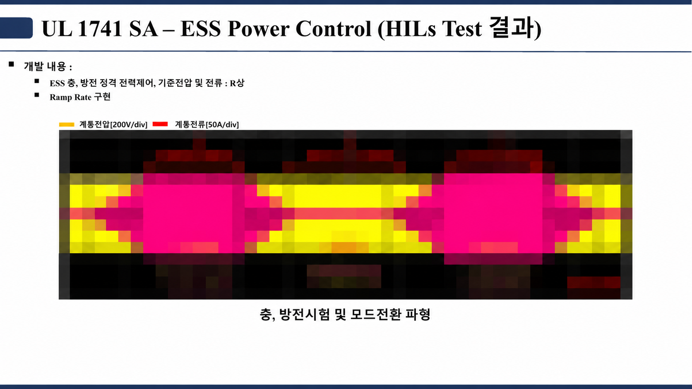
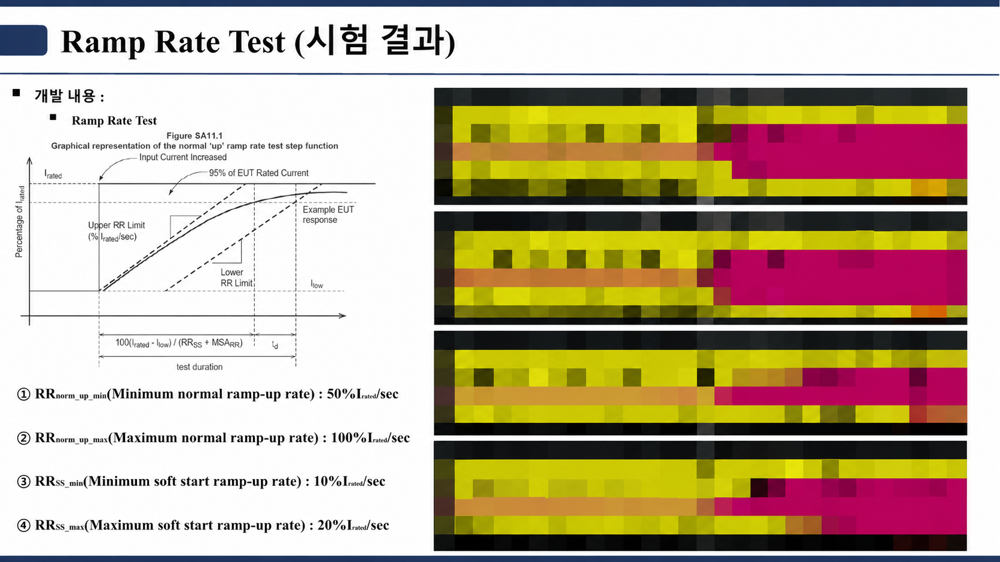
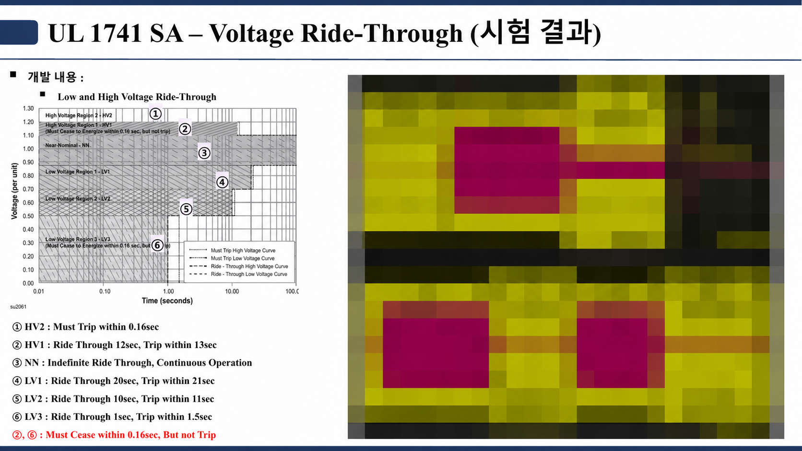
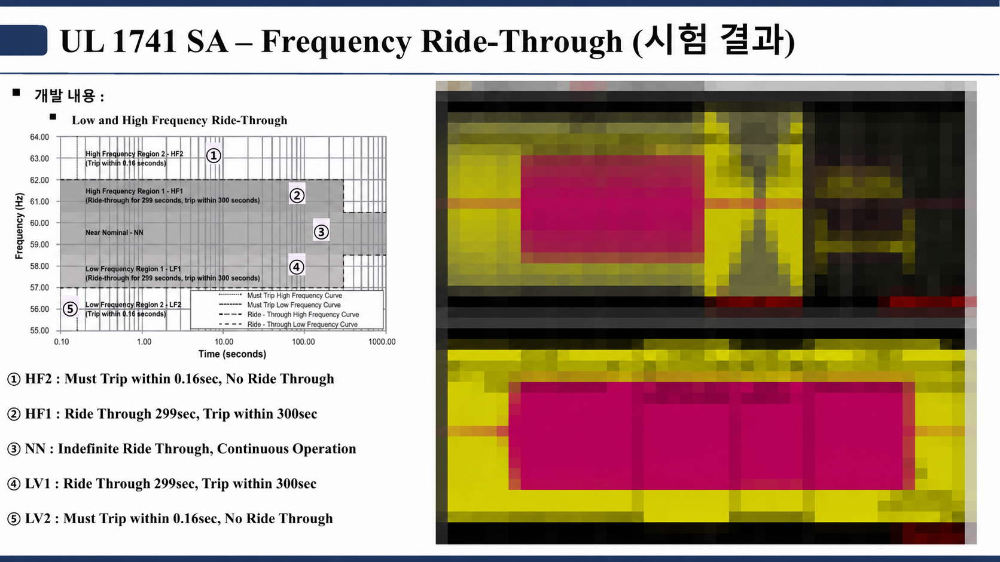
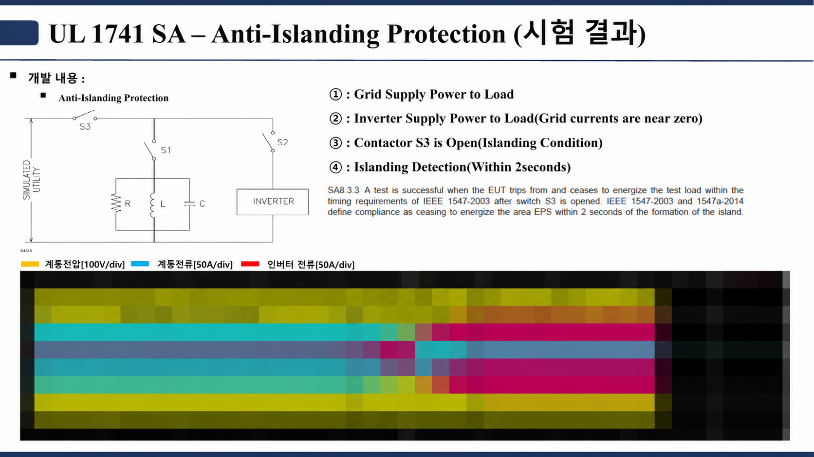
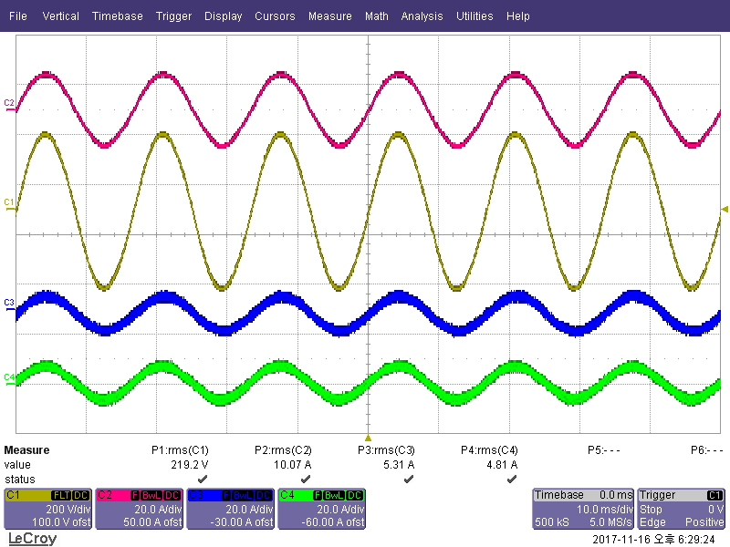
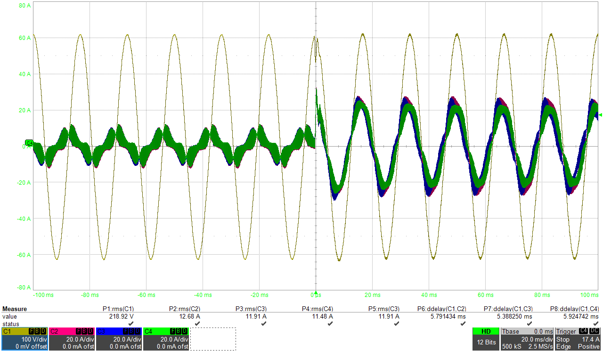
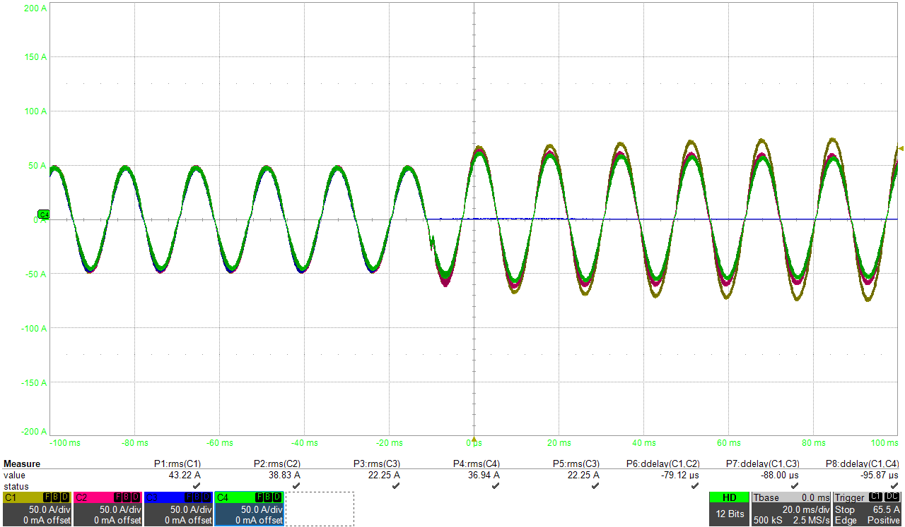

# 전력변환·계통연계 검증 포트폴리오

이 폴더는 UL 1741 SA 기반 ESS 계통연계 시험과 UPS 검증 사례를 시험 목적별로
정리합니다. UL 1741은 분산에너지자원에 사용하는 인버터·컨버터·제어기·
계통연계 장비를 다루는 표준이며, Supplement A(SA)는 계통 이상 상태에서의
전력 조정과 계통 지원 기능을 검증하기 위한 시험 방법을 보완했습니다.

> **공개 범위**
>
> UL 1741 측정 파형은 시험 조건과 케이스만 남기고 모자이크 처리했습니다.
> 아래 내용은 수행 범위와 해석 관점을 보여 주는 포트폴리오 요약이며, 공인
> 인증서나 전체 시험성적서가 아닙니다. 이미지의 수치와 시간은 해당 캡처의
> 설정·결과이므로 최신 표준의 보편 요구값으로 일반화하지 않습니다.

## 한눈에 보기

| 구분 | 시험 | 확인하려는 내용 |
|---|---|---|
| UL 1741 SA | ESS Power Control | 충전·대기·방전 상태 전환과 완만한 지령 변경 |
| UL 1741 SA | Ramp Rate | 정상 기동·소프트스타트 시 출력 변화율 |
| UL 1741 SA | Voltage Ride-Through | 전압 이상 영역별 유지 운전·출력 정지·복귀 |
| UL 1741 SA | Frequency Ride-Through | 주파수 이상 영역별 유지 운전·출력 정지·복귀 |
| UL 1741 SA | Anti-Islanding | 계통 분리 검출과 출력 정지 |
| UPS | Parallel Operation | 병렬운전 정상상태와 전류 분담 |
| UPS | Load Transient | 부하 단계 변화 시 전압 유지와 전류 응답 |
| UPS | Hot Swap | 모듈 투입·분리 시 전류 이관과 출력 연속성 |

## UL 1741 SA 시험 케이스

### 1. ESS Power Control

- **시험 목적:** ESS가 충전, 대기, 방전 지령에 따라 유효전력 방향과 크기를
  전환하는지 확인합니다.
- **시험 입력·상태:** `Charge → Stand-by → Discharge` 순으로 운전 상태를
  바꾸고, 각 상태 사이에는 급격한 계단 입력 대신 Soft Change Reference를
  적용합니다.
- **확인 항목:** 상태 전환 중 계통전압을 유지하면서 계통전류가 지령 방향으로
  이동하고, 대기 상태에서는 전력 교환이 최소화되는지를 봅니다.
- **이미지 매칭:** 공개 이미지에는 시험 제목, 개발 항목과 전압·전류 채널
  범례만 남겼습니다. 실제 모드 전환 파형과 계측값은 모자이크 처리했습니다.

### 2. Ramp Rate

- **시험 목적:** 출력 지령이 바뀔 때 ESS 전류가 설정된 변화율 범위로 증가하는지
  확인합니다.
- **시험 입력·상태:** 캡처에 사용한 네 조건은 정상 기동 `50%·100% I_rated/s`,
  소프트스타트 `10%·20% I_rated/s`입니다.
- **확인 항목:** 저전류 구간에서 정격전류의 95% 부근까지 도달하는 시간과 기울기가
  설정한 상·하한 안에 있는지를 비교합니다.
- **이미지 매칭:** 왼쪽 개념도와 ①~④ 설정값이 시험 케이스입니다. 오른쪽의 네
  측정 파형은 공개본에서 모자이크 처리했습니다.

| 번호 | 캡처 설정 | 정격 도달 시간의 해석 |
|---:|---|---|
| ① | Minimum normal ramp-up: `50% I_rated/s` | 약 2초 |
| ② | Maximum normal ramp-up: `100% I_rated/s` | 약 1초 |
| ③ | Minimum soft-start ramp-up: `10% I_rated/s` | 약 10초 |
| ④ | Maximum soft-start ramp-up: `20% I_rated/s` | 약 5초 |

### 3. Voltage Ride-Through

- **시험 목적:** 계통전압이 정상 범위를 벗어났을 때 영역별 요구시간 동안 운전을
  유지하거나 출력을 중지하고, 전압 복귀 후 정상 운전으로 돌아오는지 확인합니다.
- **시험 입력·상태:** 정상전압(NN)에서 HV 또는 LV 시험 영역으로 전압을 단계
  변경한 뒤 다시 정상전압으로 복귀시킵니다.
- **확인 항목:** `ride-through`, `cease to energize`, `trip`, `power recovery`가
  각 영역의 시간 조건과 일치하는지를 구분해 봅니다.
- **이미지 매칭:** 왼쪽 전압-시간 영역도와 ①~⑥ 목록이 시험 케이스입니다.
  오른쪽 측정 파형은 모자이크 처리했으며, cease와 trip의 세부 구분은 그림에
  남아 있는 주석을 기준으로 읽습니다.

| 번호 | 영역 | 캡처에 표시된 동작·시간 |
|---:|---|---|
| ① | HV2 | 0.16초 이내 trip |
| ② | HV1 | 12초 ride-through, 13초 이내 trip |
| ③ | NN | 연속 운전 |
| ④ | LV1 | 20초 ride-through, 21초 이내 trip |
| ⑤ | LV2 | 10초 ride-through, 11초 이내 trip |
| ⑥ | LV3 | 1초 ride-through, 1.5초 이내 trip |

### 4. Frequency Ride-Through

- **시험 목적:** 계통주파수가 정상 범위를 벗어났을 때 영역별 유지 운전 또는
  출력 정지 동작을 확인합니다.
- **시험 입력·상태:** 정상주파수(NN)에서 고주파(HF)·저주파(LF) 영역으로
  주파수를 이동한 뒤 정상 영역으로 복귀시킵니다.
- **확인 항목:** 주파수 이상 지속시간, ride-through 유지 여부, trip 시점과
  정상주파수 복귀 후 전력 회복을 봅니다.
- **이미지 매칭:** 왼쪽 주파수-시간 영역도와 ①~⑤ 목록이 시험 케이스입니다.
  오른쪽 측정 파형과 응답시간은 공개본에서 모자이크 처리했습니다.

| 번호 | 영역 | 캡처에 표시된 동작·시간 |
|---:|---|---|
| ① | HF2 | 0.16초 이내 trip, ride-through 없음 |
| ② | HF1 | 299초 ride-through, 300초 이내 trip |
| ③ | NN | 연속 운전 |
| ④ | LF1 | 299초 ride-through, 300초 이내 trip |
| ⑤ | LF2 | 0.16초 이내 trip, ride-through 없음 |

### 5. Anti-Islanding

- **시험 목적:** 계통이 분리되어 RLC 부하와 인버터만 남는 단독운전 상태를
  검출하고 제한시간 안에 부하 공급을 중지하는지 확인합니다.
- **시험 입력·상태:** 계통이 부하를 공급하는 상태에서 인버터 출력을 부하와
  가깝게 맞춘 뒤, 계통 접촉기 S3를 개방해 islanding 조건을 만듭니다.
- **확인 항목:** S3 개방 시점부터 islanding 검출과 `cease to energize`까지의
  시간을 확인합니다. 보존된 캡처는 IEEE 1547-2003 기준의 2초 요구를 표시합니다.
- **이미지 매칭:** 상단 RLC 회로와 ①~④ 절차가 시험 구성입니다. 하단의 전압·
  계통전류·인버터전류 측정 파형은 모자이크 처리했습니다.

## UPS 검증 파형

UL 1741 시험과 별개로, UPS 병렬운전과 과도상태에서 출력 연속성과 전류 분담을
확인한 파형입니다. 채널의 상세 모듈 번호가 공개 화면에 명시되지 않은 경우에는
전압·전류 채널로만 설명합니다.

### 1. Parallel Operation

- 출력전압은 `219.2 V RMS`로 표시되어 있습니다.
- 전체 전류로 보이는 채널은 `10.07 A RMS`, 두 분담 전류 채널은 각각
  `5.31 A RMS`, `4.81 A RMS`입니다.
- 두 분담 전류의 합이 전체 전류와 가까운지, 위상과 파형이 안정적으로 유지되는지
  확인하는 정상상태 자료입니다.

### 2. Load Transient

- `0 ms` 부근에서 부하전류 크기가 단계적으로 증가합니다.
- 부하 변화 전후에 출력전압 파형이 연속적으로 유지되는지 확인합니다.
- 병렬 전류 채널이 새 부하 수준으로 함께 이동하고 과도 진동이 안정화되는지를
  비교합니다.

### 3. Hot Swap

- `0 ms` 부근의 모듈 투입·분리 이벤트 전후 전류 채널 변화를 비교합니다.
- 한 채널의 전류가 사라지거나 추가될 때 나머지 채널로 부하가 이관되는지 봅니다.
- 전류 이관 중 출력 공급이 끊기지 않고 파형이 새로운 정상상태로 수렴하는지가
  핵심 확인 항목입니다.

## 참고자료

- [UL Solutions — Distributed Energy Resource Testing](https://www.ul.com/services/distributed-energy-resource-testing)
- [UL Solutions — UL 1741 SA Advanced Inverter Testing](https://www.ul.com/news/ul-launches-advanced-inverter-testing-and-certification-program)
- [IEEE Resource Center — Revised IEEE 1547](https://resourcecenter.ieee.org/education/tutorials/pes_ed_tut04_1547_091318_sld)

## 공개·해석 원칙

- 비공개 회로·제어 파라미터와 원본 계측 파형은 공개하지 않습니다.
- 파일명은 외부 링크가 끊기지 않도록 유지합니다.
- 표준 판정은 적용 판본, Source Requirement Document와 시험 조건을 함께
  확인해야 하며, 이 페이지의 요약만으로 적합성을 판정하지 않습니다.
