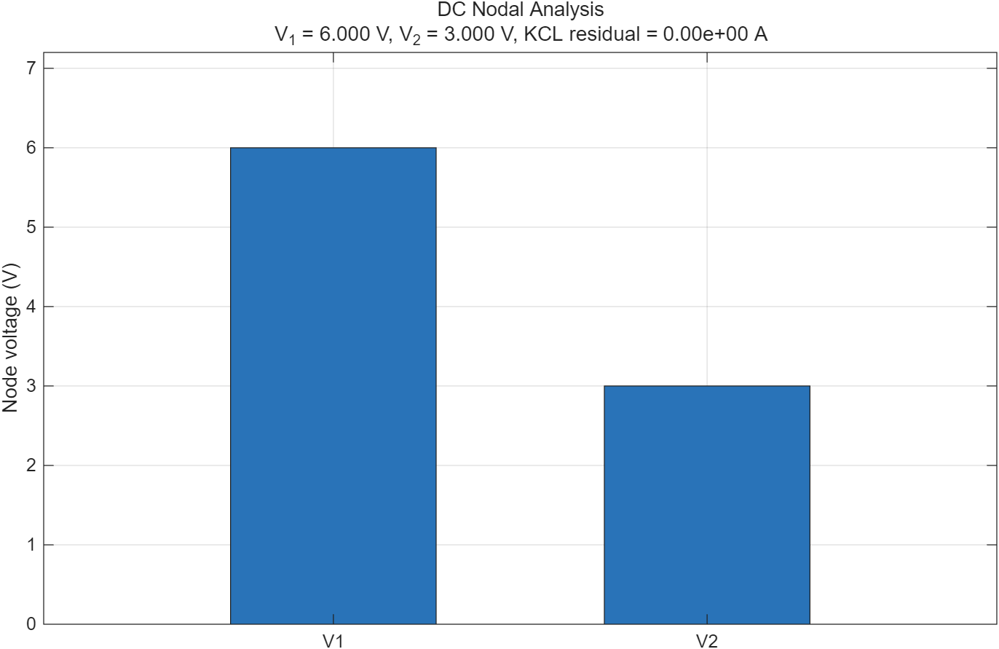

# 직류회로 해석

## 학습 목표

- 노달해석과 메시해석의 미지수·방정식 수를 결정한다.
- 전압원과 전류원이 포함된 회로를 행렬식으로 표현한다.
- 슈퍼노드와 슈퍼메시에서 회로식과 구속식을 분리한다.
- MATLAB 선형연립방정식 해와 KCL 잔차로 결과를 검증한다.

## 1. 노달해석

기준 노드의 전위를 0 V로 두고 나머지 노드 전압을 미지수로 선택한다. 각
비기준 노드에 KCL을 쓰면 저항성 회로는 다음 형태가 된다.

$$
\mathbf{G}\mathbf{v}=\mathbf{i}
$$

$\mathbf{G}$의 대각 성분은 해당 노드에 연결된 컨덕턴스의 합이고, 비대각
성분은 두 노드 사이 컨덕턴스의 음수다. 기준 노드와 연결되지 않은 이상적인
전압원이 두 비기준 노드 사이에 있으면 두 노드를 슈퍼노드로 묶는다.

## 2. 메시해석

평면회로의 각 독립 메시 전류를 미지수로 두고 KVL을 쓴다. 두 메시가 저항을
공유하면 그 가지 전류는 두 메시 전류의 차가 된다. 두 메시 사이 전류원은
슈퍼메시로 처리하고 전류원의 구속식을 추가한다.

| 기준 | 노달해석 | 메시해석 |
|---|---|---|
| 기본 법칙 | KCL | KVL |
| 미지수 | 노드 전압 | 메시 전류 |
| 유리한 회로 | 전류원이 많거나 노드가 적음 | 전압원이 많거나 메시가 적음 |
| 제한 | 없음 | 평면회로에 직접 적용 |

## 3. 슈퍼노드와 슈퍼메시

두 비기준 노드 $a$, $b$ 사이에 이상 전압원 $V_s$가 있으면 전압원을 포함한
경계를 슈퍼노드로 묶는다. 경계 밖으로 흐르는 전류에 KCL을 적용하고 다음
전압 구속식을 함께 푼다.

$$
v_a-v_b=V_s
$$

두 메시 사이에 이상 전류원 $I_s$가 있으면 그 가지를 제외한 바깥 경로에 KVL을
쓰고, 기준 방향에 맞춰 $i_1-i_2=\pm I_s$를 추가한다. 전압원 전류나 전류원
전압을 임의로 0이라고 두지 않는 것이 핵심이다.

## 4. 계산 예제

12 V 노드가 $R_1=1\,\text{k}\Omega$를 거쳐 $V_1$에 연결되고, $V_1$에는
$R_2=2\,\text{k}\Omega$ 접지 저항과 $R_3=1\,\text{k}\Omega$를 거친 $V_2$가
연결되어 있다. $V_2$는 $R_4=1\,\text{k}\Omega$로 접지된다.

단위를 kΩ와 mA로 통일하면

$$
\begin{bmatrix}2.5&-1\\-1&2\end{bmatrix}
\begin{bmatrix}V_1\\V_2\end{bmatrix}
=\begin{bmatrix}12\\0\end{bmatrix}
$$

따라서 $V_1=6$ V, $V_2=3$ V다. $V_1$에서 나가는 전류는
$3\,\text{mA}+3\,\text{mA}$이고 전원 쪽에서 들어오는 전류는 6 mA이므로 KCL이
만족된다.

## 5. MATLAB 실습

- [노달해석 코드](./examples/dc_nodal_analysis.m)
- 실행 결과는 $\lVert\mathbf{Gv-i}\rVert_\infty$ 잔차와 노드 전압을 출력한다.

## 6. 실무 연결과 주의점

- 저항값을 Ω로 쓸지 kΩ로 쓸지 행렬 전체에서 통일한다.
- MATLAB에서는 `inv(G)*i`보다 `G\i`가 수치적으로 안정적이고 빠르다.
- 잔차가 작아도 조건수가 매우 나쁜 행렬이면 해가 민감할 수 있으므로 저항
  스케일 차이가 큰 회로는 `rcond(G)`도 확인한다.

## 7. 자가 점검

1. 비기준 노드가 4개인 회로의 기본 노달 방정식 수는 몇 개인가?
2. 위 예제에서 $R_4$가 단선되면 $V_2$는 얼마가 되는가?
3. 두 비기준 노드 사이의 이상 전압원을 노달해석할 때 필요한 두 식은?

정답

1. 4개. 전압원 구속식이 필요하면 보조식이 추가될 수 있다.
2. $R_3$에 정상전류가 흐르지 않으므로 $V_2=V_1=8$ V.
3. 슈퍼노드 경계의 KCL 식과 전압원의 전압 구속식.

## 참고자료

- [MIT OCW 6.002 — Video Lectures](https://ocw.mit.edu/courses/6-002-circuits-and-electronics-spring-2007/video_galleries/video-lectures/) — Basic Circuit Analysis Method
- [OpenStax — Kirchhoff's Rules](https://openstax.org/books/university-physics-volume-2/pages/10-3-kirchhoffs-rules) — 다중 루프와 노드 해석
- [MathWorks — Systems of Linear Equations](https://www.mathworks.com/help/matlab/math/systems-of-linear-equations.html) — `A\b` 선형계 풀이
