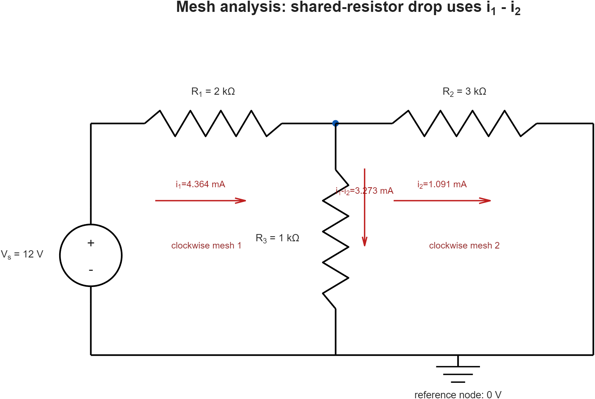
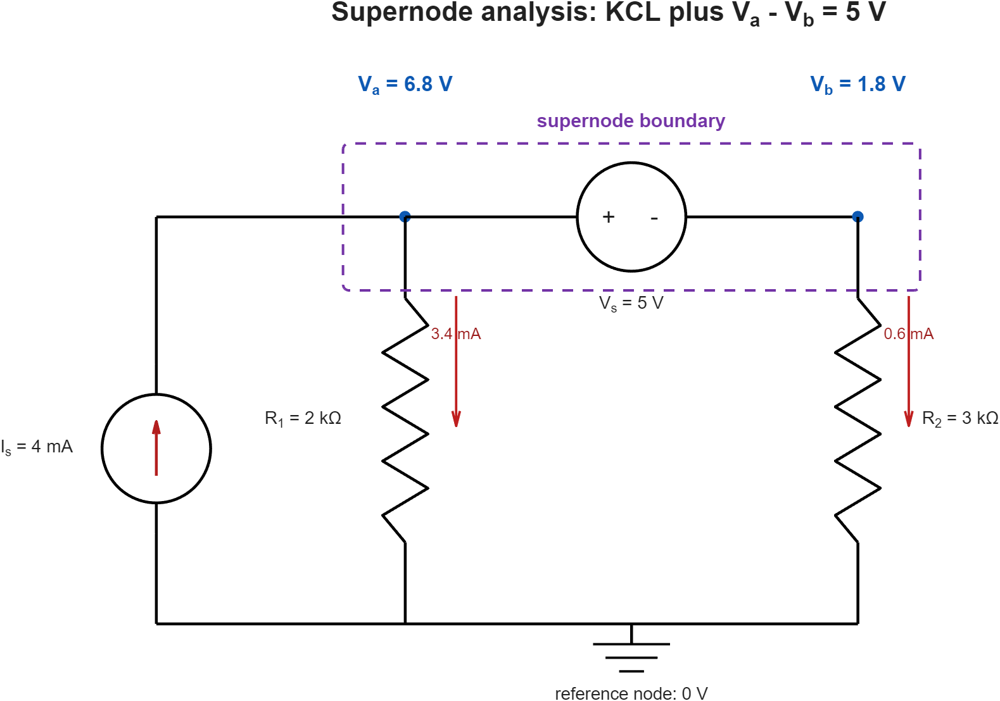

# 직류회로 해석

직류회로 해석은 **회로도에서 기준 노드·미지수·전류 방향을 먼저 정한 뒤**
KCL 또는 KVL을 수식으로 옮기는 작업입니다. 회로 연결을 문장만으로 추측하지
않도록, 이 단원은 모든 계산을 회로도 바로 아래에서 전개합니다.

## 학습 목표

- 회로도에서 기준 노드, 노드전압, 메시전류와 소스 극성을 표시한다.
- 각 가지 전류를 옴의 법칙으로 정의한 뒤 KCL 노달 방정식을 작성한다.
- 공유저항의 실제 가지전류를 이용해 KVL 메시 방정식을 작성한다.
- 이상 전압원을 포함한 슈퍼노드에 KCL과 전압 구속식을 함께 적용한다.
- MATLAB 해와 KCL·KVL 잔차로 손계산 결과를 검증한다.

## 해석 공통 절차

1. 회로를 다시 그리지 말고 주어진 회로에서 **노드와 소자 연결**을 먼저 읽습니다.
2. 기준 노드 0 V, 전압 극성, 전류 기준방향을 회로도에 표시합니다.
3. 미지수를 정한 뒤 각 가지 전류를 미지수로 표현합니다.
4. 수치를 대입하기 전에 KCL 또는 KVL 원형식을 먼저 씁니다.
5. 단위를 Ω·A 또는 kΩ·mA 중 하나로 통일해 행렬을 풉니다.
6. 잔차, 전력수지 또는 독립적인 가지식으로 결과를 검산합니다.

## 1. 노달해석 — 회로에서 KCL 행렬 만들기

아래 회로는 12 V 노드에서 $R_1$을 거쳐 $V_1$으로 들어오고, $V_1$과
$V_2$가 $R_3$으로 연결된 2노드 저항회로입니다. 파란 점이 미지 노드이고
아래 도선 전체가 기준 노드 0 V입니다.


### 1.1 가지전류를 노드전압으로 표현

회로도에 표시된 방향을 양(+)으로 잡으면

$$
i_{R1}=\frac{12-V_1}{R_1},\qquad
i_{R2}=\frac{V_1}{R_2},\qquad
i_{R3}=\frac{V_1-V_2}{R_3},\qquad
i_{R4}=\frac{V_2}{R_4}
$$

입니다. $V_1$에서는 $i_{R1}$이 들어오고 $i_{R2}$와 $i_{R3}$이 나가므로

$$
\frac{V_1-12}{1}+\frac{V_1}{2}+\frac{V_1-V_2}{1}=0
$$

$V_2$에서는 $i_{R3}$이 들어오고 $i_{R4}$가 나가므로

$$
\frac{V_2-V_1}{1}+\frac{V_2}{1}=0
$$

입니다. 여기서는 저항을 kΩ, 전류를 mA로 사용했으므로 전압은 V로 바로
계산됩니다.

### 1.2 행렬과 해

두 KCL 식을 정리하면

$$
\begin{bmatrix}
2.5&-1\\
-1&2
\end{bmatrix}
\begin{bmatrix}V_1\\V_2\end{bmatrix}
=
\begin{bmatrix}12\\0\end{bmatrix}
$$

이고 해는

$$
V_1=6\,\text{V},\qquad V_2=3\,\text{V}
$$

입니다. 가지전류는

$$
i_{R1}=6\,\text{mA},\quad
i_{R2}=3\,\text{mA},\quad
i_{R3}=3\,\text{mA},\quad
i_{R4}=3\,\text{mA}
$$

이므로 두 노드 모두에서 유입전류와 유출전류가 일치합니다.

### 1.3 전력수지로 다시 검산

전원이 공급하는 전력은 $12\times6=72$ mW입니다. 저항 소비전력은

$$
P_{R1}=36,\quad P_{R2}=18,\quad P_{R3}=9,\quad P_{R4}=9\ \text{mW}
$$

이고 합이 72 mW이므로 회로 전체의 전력수지도 맞습니다.

## 2. 메시해석 — 공유저항의 전류부터 정하기

아래 평면회로에서 두 메시전류 $i_1$, $i_2$를 모두 시계방향으로 정의합니다.
가운데 공유저항 $R_3$에는 두 메시전류가 반대 방향으로 지나므로 위에서 아래로
흐르는 실제 가지전류는 $i_1-i_2$입니다.



### 2.1 메시별 KVL

왼쪽 메시를 시계방향으로 돌면

$$
-12+2i_1+1(i_1-i_2)=0
$$

오른쪽 메시를 시계방향으로 돌면

$$
3i_2+1(i_2-i_1)=0
$$

입니다. kΩ·mA 단위로 정리하면

$$
\begin{bmatrix}
3&-1\\
-1&4
\end{bmatrix}
\begin{bmatrix}i_1\\i_2\end{bmatrix}
=
\begin{bmatrix}12\\0\end{bmatrix}
$$

이고

$$
i_1=4.364\,\text{mA},\qquad
i_2=1.091\,\text{mA}
$$

를 얻습니다. 공유저항 전류는

$$
i_{R3}=i_1-i_2=3.273\,\text{mA}
$$

입니다. 왼쪽 루프의 전압강하
$2(4.364)+1(3.273)=12.001$ V와 오른쪽 루프의
$3(1.091)=1(3.273)=3.273$ V가 반올림 오차 안에서 KVL을 만족합니다.

## 3. 슈퍼노드 — 전압원 내부전류 대신 구속식 사용

두 비기준 노드 $V_a$, $V_b$ 사이에 이상 전압원이 있으면 전압원 전류를
옴의 법칙으로 쓸 수 없습니다. 점선 경계를 하나의 슈퍼노드로 묶어 바깥으로
나가는 전류에 KCL을 적용하고, 전압원의 극성으로 구속식을 추가합니다.



4 mA 전류원이 슈퍼노드로 전류를 주입하므로

$$
\frac{V_a}{2}+\frac{V_b}{3}=4
$$

이고, 5 V 전압원의 왼쪽이 `+`이므로

$$
V_a-V_b=5
$$

입니다. 두 식을 함께 풀면

$$
V_a=6.8\,\text{V},\qquad V_b=1.8\,\text{V}
$$

가 됩니다. 접지로 흐르는 전류는 각각 3.4 mA와 0.6 mA이므로 합이 전류원
4 mA와 일치합니다.

## 4. 어떤 해석법을 선택할까

| 회로 특징 | 먼저 선택할 방법 | 이유 |
|---|---|---|
| 비기준 노드가 적고 전류원이 많음 | 노달해석 | KCL 식 수가 적음 |
| 평면회로이고 메시가 적으며 전압원이 많음 | 메시해석 | KVL 식 수가 적음 |
| 두 비기준 노드 사이에 이상 전압원이 있음 | 슈퍼노드 | 전압원 전류 대신 전압 구속식 사용 |
| 두 메시 사이에 이상 전류원이 있음 | 슈퍼메시 | 전류원 전압 대신 전류 구속식 사용 |

같은 회로는 어느 방법으로도 풀 수 있지만, 미지수와 방정식이 적어지는 방법을
선택하면 부호 실수가 줄어듭니다.

## 5. MATLAB 검증과 재생성

- [노달해석 코드](./examples/dc_nodal_analysis.m)
- [메시해석 코드](./examples/dc_mesh_analysis.m)
- [슈퍼노드 코드](./examples/dc_supernode_analysis.m)
- [직류회로 3예제 실행기](./examples/run_dc_analysis_examples.m)
- [회로도 렌더러](./examples/render_dc_circuit.m)
- [수치·캡처 회귀시험](./examples/test_dc_analysis_examples.m)

세 회로도는 해석 코드가 사용한 저항값·소스값·계산 결과를 받아 MATLAB이
직접 생성합니다. 회로도와 수식이 서로 다른 값을 가리키는 일을 막기 위해
테스트는 노드전압, 메시전류, 구속식 잔차와 PNG 해상도를 함께 확인합니다.

```matlab
cd('studies/전공학습/01_전기전자_핵심기초/01_회로이론/02_직류회로_해석/examples')
run_dc_analysis_examples
results = runtests('test_dc_analysis_examples.m');
assertSuccess(results)
```

## 6. 자주 틀리는 지점

- 회로도를 보지 않고 저항의 직렬·병렬 관계를 문장만으로 추정하지 않습니다.
- 기준 노드와 전류 화살표를 정한 뒤 계산 중에 방향을 바꾸지 않습니다.
- 노달해석에서는 한 가지 전류를 양쪽 노드 KCL에 반대 부호로 넣습니다.
- 메시해석의 공유저항 전류는 한 메시전류가 아니라 두 전류의 차입니다.
- 슈퍼노드 내부 전압원 전류를 0으로 두지 말고 전압 구속식을 추가합니다.
- `inv(A)*b` 대신 `A\b`를 사용하고, 해를 구한 뒤 반드시 잔차를 계산합니다.

## 7. 자가 점검

1. 노달회로 그림에서 $R_4$가 단선되면 $V_1$, $V_2$는 얼마인가?
2. 메시회로 그림에서 $R_3$의 아래 방향 가지전류는 어떤 식으로 표현하는가?
3. 슈퍼노드 회로의 5 V 전압원 극성을 반대로 바꾸면 $V_a$, $V_b$는 얼마인가?

<details><summary>정답</summary>

1. $R_3$에 정상전류가 흐르지 않으므로 $V_1=V_2=8$ V입니다.
2. 두 메시전류가 모두 시계방향이므로 $i_{R3}=i_1-i_2$입니다.
3. $V_a-V_b=-5$와 $V_a/2+V_b/3=4$를 풀면
   $V_a=2.8$ V, $V_b=7.8$ V입니다.

</details>

## 참고자료

- [MIT OCW 6.002 — Video Lectures](https://ocw.mit.edu/courses/6-002-circuits-and-electronics-spring-2007/video_galleries/video-lectures/) — Basic Circuit Analysis Method
- [OpenStax — Kirchhoff's Rules](https://openstax.org/books/university-physics-volume-2/pages/10-3-kirchhoffs-rules) — 다중 루프와 노드 해석
- [MathWorks — Systems of Linear Equations](https://www.mathworks.com/help/matlab/math/systems-of-linear-equations.html) — `A\b` 선형계 풀이
