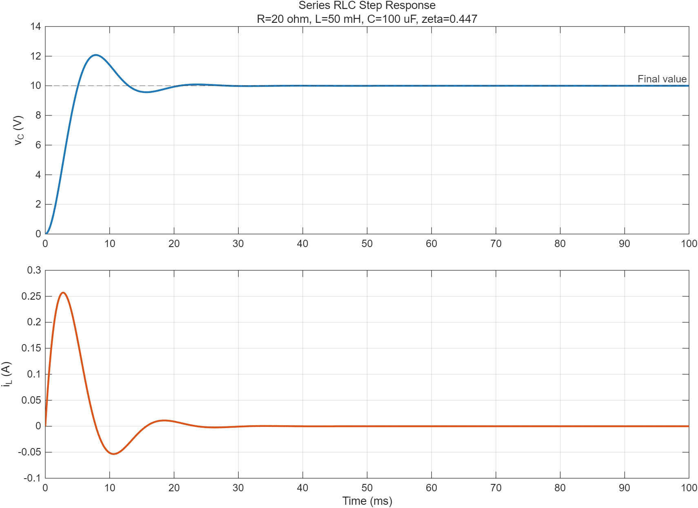

# 1차·2차 과도응답

## 학습 목표

- 스위칭 직전과 직후의 커패시터 전압·인덕터 전류를 연결한다.
- 1차 회로의 시정수와 정상상태를 이용해 완전응답을 구한다.
- 2차 RLC 회로의 과감쇠·임계감쇠·부족감쇠를 판별한다.

## 1. 상태의 연속성

이상 소자에서 유한한 전류와 전압을 가정하면

$$
v_C(0^+)=v_C(0^-), \qquad i_L(0^+)=i_L(0^-)
$$

이다. 반면 저항 전압과 전류는 스위칭 순간에 불연속적으로 변할 수 있다.
$t<0$에서 충분히 오래 직류 정상상태였다면 커패시터는 개방, 인덕터는 단락으로
바꾸어 초기조건을 계산한다.

## 2. 1차 회로

1차 응답은 초기값과 최종값, 시정수만 알면 다음 공통형으로 쓸 수 있다.

$$
x(t)=x(\infty)+[x(0^+)-x(\infty)]e^{-t/\tau}
$$

$$
\tau_{RC}=R_{eq}C, \qquad \tau_{RL}=\frac{L}{R_{eq}}
$$

$R_{eq}$는 에너지 저장소자에서 회로 쪽을 바라본 등가저항이다. 약 $5\tau$가
지나면 오차가 초기 변화량의 1%보다 작아진다.

## 3. 2차 직렬 RLC 회로

직렬 RLC의 자연응답 특성방정식은

$$
s^2+2\alpha s+\omega_0^2=0, \qquad
\alpha=\frac{R}{2L}, \quad \omega_0=\frac{1}{\sqrt{LC}}
$$

이다.

| 조건 | 응답 |
|---|---|
| $\alpha>\omega_0$ | 과감쇠: 서로 다른 두 실수 극점 |
| $\alpha=\omega_0$ | 임계감쇠: 가장 빠른 비진동 응답 |
| $\alpha<\omega_0$ | 부족감쇠: $\omega_d=\sqrt{\omega_0^2-\alpha^2}$로 감쇠 진동 |

## 4. 계산 예제

5 V 계단입력, $R=1\,\text{k}\Omega$, $C=100\,\mu\text{F}$인 RC 회로는
$\tau=0.1$ s다. 초기 전압이 0 V이면

$$
v_C(t)=5(1-e^{-t/0.1})
$$

이고 $t=0.1$ s에서 3.16 V, $t=0.5$ s에서 약 4.97 V다.

## 5. MATLAB 실습

- [RLC 계단응답 코드](./examples/rlc_transient_response.m)
- `ode45`로 $i_L$와 $v_C$의 상태방정식을 적분하고 정상상태 오차를 검증한다.

## 학습·검증 기록

- **핵심 정리:** 스위칭 직후의 $v_C$와 $i_L$은 직전 값을 이어받고, 2차 회로의 감쇠 형태는 $\alpha$와 $\omega_0$의 크기 관계로 구분한다.
- **확인 근거:** RC 예제는 $\tau=0.1$ s와 초기전압 0 V에서 $v_C(0.1)=3.16$ V, $v_C(0.5)\approx4.97$ V를 보이며, MATLAB RLC 예제는 상태방정식 적분 결과의 정상상태 오차를 검증한다.
- **다음 탐구:** 동일한 L·C에서 R을 바꾸어 과감쇠·임계감쇠·부족감쇠 파형과 정착시간을 비교한다.

## 참고자료

- [OpenStax — RC Circuits](https://openstax.org/books/university-physics-volume-2/pages/10-5-rc-circuits) — 충·방전과 시정수
- [MIT OCW 6.002 — Video Lectures](https://ocw.mit.edu/courses/6-002-circuits-and-electronics-spring-2007/video_galleries/video-lectures/) — Capacitors, First-Order and Second-Order Systems
- [MathWorks — ode45](https://www.mathworks.com/help/matlab/ref/ode45.html) — 비강성 미분방정식 수치적분
