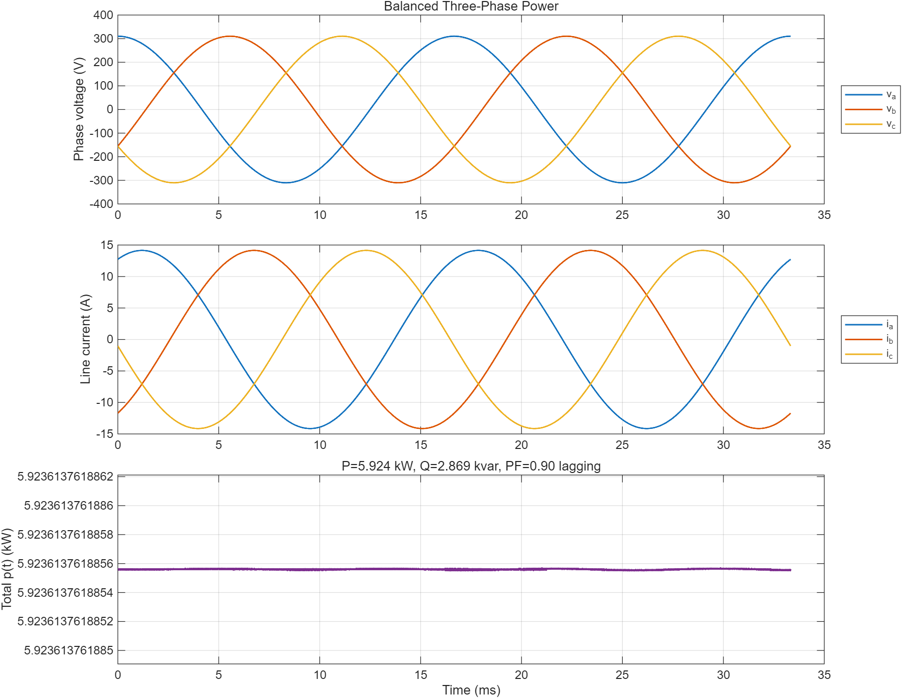

# 교류전력과 3상회로

## 학습 목표

- 유효·무효·피상전력과 역률을 복소전력으로 연결한다.
- 평형 Y·Δ 결선의 선간값과 상값 관계를 사용한다.
- 순간전력 평균과 페이저 전력식이 일치하는지 검증한다.

## 1. 단상 복소전력

RMS 페이저를 사용하면

$$
\mathbf S=\mathbf V\mathbf I^*=P+jQ, \qquad |S|=VI
$$

$$
P=VI\cos\phi, \qquad Q=VI\sin\phi, \qquad PF=\frac{P}{|S|}
$$

$P$는 평균적으로 소비·변환되는 유효전력(W), $Q$는 저장소자와 소스 사이를
왕복하는 무효전력(var), $|S|$는 설비 전류·전압 정격과 관련된 피상전력(VA)이다.

## 2. 평형 3상 관계

| 결선 | 전압 관계 | 전류 관계 |
|---|---|---|
| Y | $V_L=\sqrt3V_{ph}$ | $I_L=I_{ph}$ |
| Δ | $V_L=V_{ph}$ | $I_L=\sqrt3I_{ph}$ |

평형 부하의 총전력은 결선 방식과 무관하게 선간전압과 선전류로 쓸 수 있다.

$$
P=\sqrt3V_LI_L\cos\phi, \quad
Q=\sqrt3V_LI_L\sin\phi, \quad
|S|=\sqrt3V_LI_L
$$

평형 3상 순간전력의 합은 일정하므로 단상보다 토크와 DC 링크 전력 맥동이 작다.

## 3. 계산 예제

$V_L=380$ V, $I_L=10$ A, 지상역률 0.9인 평형 부하에서

$$
|S|=6.58\,\text{kVA}, \qquad
P=5.92\,\text{kW}, \qquad
Q=2.87\,\text{kvar}
$$

이다. Y결선이면 상전압은 $380/\sqrt3=219.4$ V다.

## 4. MATLAB 실습

- [평형 3상 전력 코드](./examples/three_phase_power.m)
- 세 상의 전압·전류 파형과 전체 순간전력을 계산하고 평균값을 복소전력식과 비교한다.

## 5. 실무 연결과 주의점

- `leading`과 `lagging`을 부호 없이 역률 숫자만으로 기록하면 $Q$ 방향을 잃는다.
- 선간전압과 상전압을 혼용하면 $\sqrt3$ 배 오류가 발생한다.
- 불평형·고조파 부하에서는 단순 평형식 대신 각 상의 복소전력을 직접 합산한다.
- 인버터·모터 시험에서는 전력분석기의 3상 결선과 전압 기준을 먼저 확인한다.

## 6. 자가 점검

1. 400 V, 20 A, 역률 1인 평형 3상의 유효전력은?
2. 평형 Δ부하에서 상전류가 5 A이면 선전류는?

정답

1. $\sqrt3\times400\times20=13.86$ kW.
2. $5\sqrt3=8.66$ A.

## 참고자료

- [MIT OCW 6.061 — Introduction to Electric Power Systems, Chapter 3](https://www.ocw.mit.edu/courses/6-061-introduction-to-electric-power-systems-spring-2011/c6393a58319200a5344752de0cf47ec4_MIT6_061S11_ch3.pdf) — 다상 시스템과 3상 관계
- [OpenStax — Power in an AC Circuit](https://openstax.org/books/university-physics-volume-2/pages/15-4-power-in-an-ac-circuit) — RMS, 평균전력, 역률
- [OpenStax — Chapter 15 Summary](https://openstax.org/books/university-physics-volume-2/pages/15-summary) — 교류 전력 핵심식
