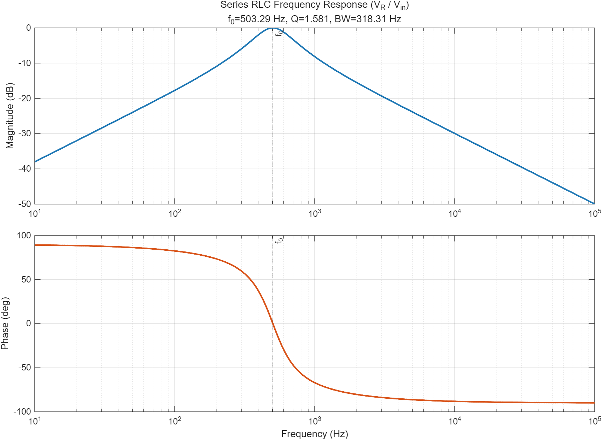

# 공진과 주파수응답

## 학습 목표

- 전달함수의 크기·위상으로 주파수응답을 해석한다.
- 직렬·병렬 RLC 공진의 물리적 차이를 설명한다.
- 공진주파수, 품질계수, 대역폭의 관계를 계산한다.

## 1. 주파수응답

선형 시불변 회로에 정현파를 인가하면 정상상태 출력은 같은 주파수의
정현파가 되고 크기와 위상만 변한다.

$$
H(j\omega)=\frac{\mathbf V_o(j\omega)}{\mathbf V_i(j\omega)}
$$

보드선도는 $20\log_{10}|H|$와 $\angle H$를 로그 주파수축에 표시한다.
극점은 일반적으로 기울기를 낮추고 위상지연을, 영점은 기울기를 높이고
위상선행을 만든다.

## 2. 직렬 RLC 공진

$$
Z=R+j\left(\omega L-\frac{1}{\omega C}\right)
$$

공진에서는 $X_L=X_C$이므로 입력 임피던스가 최소인 $R$이 되고 전류가 최대다.

$$
\omega_0=\frac{1}{\sqrt{LC}}, \qquad
Q=\frac{\omega_0L}{R}=\frac{1}{\omega_0CR}, \qquad
BW=\frac{\omega_0}{Q}=\frac{R}{L}
$$

대역폭의 단위를 Hz로 쓰면 $BW_f=R/(2\pi L)$다. 반전력점에서는 전력이
최대값의 절반이고 크기는 최대값의 $1/\sqrt2$다.

## 3. 병렬 공진

이상 병렬 LC에서는 어드미턴스의 허수부가 0이 되어 입력 임피던스가 최대가
된다. 실제 코일 저항과 부하가 품질계수를 낮추며, 직렬 공진과 달리 소스 전류는
작아도 L·C 가지 사이에 큰 순환전류가 흐를 수 있다.

## 4. 계산 예제

$R=20\,\Omega$, $L=10$ mH, $C=10\,\mu$F인 직렬 RLC에서

$$
f_0=\frac{1}{2\pi\sqrt{LC}}=503.3\,\text{Hz}, \quad
Q=1.58, \quad BW_f=318.3\,\text{Hz}
$$

이다. $Q$가 높을수록 공진 피크가 날카롭고 소자 오차와 손실 변화에 민감하다.

## 5. MATLAB 실습

- [직렬 RLC 주파수응답 코드](./examples/series_rlc_frequency_response.m)
- 이론 공진주파수와 수치 스윕의 피크 주파수를 비교한다.

## 학습·검증 기록

- **핵심 정리:** 직렬 RLC의 Q는 공진 피크의 날카로움과 대역폭을 함께 나타내며, $BW=\omega_0/Q$ 관계로 손실 저항의 영향을 연결한다.
- **확인 근거:** $R=20$ Ω, $L=10$ mH, $C=10$ μF 예제에서 $f_0=503.3$ Hz, $Q=1.58$, $BW_f=318.3$ Hz이고, MATLAB 예제는 이론 공진주파수와 수치 스윕의 피크를 비교한다.
- **다음 탐구:** R을 단계적으로 바꾸어 계산한 Q·대역폭과 주파수응답 피크의 변화를 함께 비교한다.

## 참고자료

- [OpenStax — RLC Series Circuits with AC](https://openstax.org/books/university-physics-volume-2/pages/15-3-rlc-series-circuits-with-ac) — 임피던스와 위상
- [OpenStax — Resonance in an AC Circuit](https://openstax.org/books/university-physics-volume-2/pages/15-5-resonance-in-an-ac-circuit) — 공진주파수와 대역폭
- [MIT OCW 6.002 — Video Lectures](https://ocw.mit.edu/courses/6-002-circuits-and-electronics-spring-2007/video_galleries/video-lectures/) — Frequency Response와 Filters
