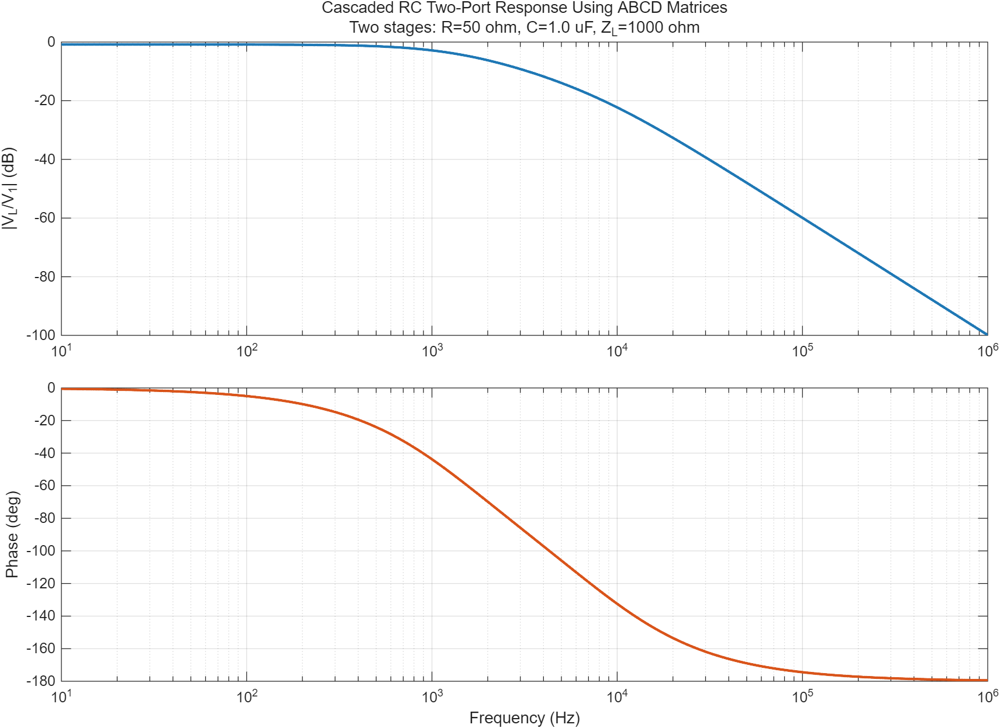

# 결합회로와 2포트망

## 학습 목표

- 상호인덕턴스와 점표기법으로 결합 인덕터의 전압 부호를 정한다.
- Z·Y·ABCD 파라미터의 정의와 사용 목적을 구분한다.
- ABCD 행렬 곱으로 다단 회로를 계산한다.
- 부하가 연결된 2포트의 입력 임피던스와 변압기 반사 임피던스를 구한다.

## 1. 자기결합과 점표기

두 코일의 자속이 서로 결합하면

$$
M=k\sqrt{L_1L_2}, \qquad 0\le k\le1
$$

이고 전압식은 기준 방향에 따라

$$
v_1=L_1\frac{di_1}{dt}\pm M\frac{di_2}{dt}, \qquad
v_2=\pm M\frac{di_1}{dt}+L_2\frac{di_2}{dt}
$$

가 된다. 두 기준전류가 모두 점단자로 들어가거나 모두 나가면 상호항의 부호가
같고, 하나만 점단자로 들어가면 반대다. 이상 변압기에서는
$V_1/V_2=N_1/N_2$, $I_1/I_2=-N_2/N_1$ 관계를 사용한다.

## 2. 2포트 파라미터

| 형식 | 정의 | 유리한 연결 |
|---|---|---|
| Z | $[V]=[Z][I]$ | 직렬 연결 |
| Y | $[I]=[Y][V]$ | 병렬 연결 |
| ABCD | $[V_1\ I_1]^T=[A\ B;C\ D][V_2\ -I_2]^T$ 관례 | 종속 연결 |

전류 방향 관례에 따라 ABCD 식의 $I_2$ 부호가 달라질 수 있으므로 사용한 정의를
문서에 반드시 적는다. 이 프로젝트의 MATLAB 예제는 부하로 흘러가는 전류를
$I_L=V_2/Z_L$로 두고 $V_1=AV_2+BI_L$를 사용한다.

## 3. 기본 ABCD 블록

직렬 임피던스와 병렬 어드미턴스의 행렬은

$$
\mathbf T_Z=\begin{bmatrix}1&Z\\0&1\end{bmatrix}, \qquad
\mathbf T_Y=\begin{bmatrix}1&0\\Y&1\end{bmatrix}
$$

이다. 입력에서 출력 순서로 $n$개 블록을 연결하면
$\mathbf T=\mathbf T_1\mathbf T_2\cdots\mathbf T_n$이다. 상호성 2포트는
$AD-BC=1$을 만족한다.

## 4. 입력 임피던스와 반사 임피던스

출력에 $Z_L$이 연결된 ABCD 2포트의 입력 임피던스는

$$
Z_{in}=\frac{AZ_L+B}{CZ_L+D}
$$

이다. 이상 변압기의 권수비를 $n=N_1/N_2$로 두면 2차측 부하는 1차측에서

$$
Z_{in}=n^2Z_L
$$

로 보인다. 임피던스는 권수비의 제곱으로 변환되지만 이상 변압기가 전력을
만드는 것은 아니다. 전압 증가와 전류 감소가 서로 상쇄되어 입력·출력 전력이 같다.

## 5. 계산 예제

10 Ω 직렬 블록 두 개를 종속 연결하면

$$
\mathbf T=\begin{bmatrix}1&10\\0&1\end{bmatrix}^2
=\begin{bmatrix}1&20\\0&1\end{bmatrix}
$$

이다. $Z_L=100\,\Omega$이고 이상 전압원이 입력을 구동하면

$$
\frac{V_2}{V_1}=\frac{1}{A+B/Z_L}=\frac{1}{1+20/100}=0.8333
$$

이다.

## 6. MATLAB 실습

- [ABCD 종속연결 코드](./examples/two_port_abcd_cascade.m)
- R-C 2포트 두 단의 주파수응답과 $AD-BC=1$ 상호성 잔차를 계산한다.

## 학습·검증 기록

- **핵심 정리:** 결합계수 $k$는 $M=k\sqrt{L_1L_2}$로 상호인덕턴스를 정하고, ABCD 행렬은 물리적 종속 순서대로 곱해 다단 2포트를 하나의 블록으로 나타낸다.
- **확인 근거:** 10 Ω 직렬 블록 두 단의 행렬 곱은 $\begin{bmatrix}1&20\\0&1\end{bmatrix}$이 되어 100 Ω 부하에서 $V_2/V_1=0.8333$이고, MATLAB 예제는 R-C 두 단의 응답과 $AD-BC=1$ 상호성 잔차를 계산한다.
- **다음 탐구:** 결합계수 변화에 따른 반사 임피던스를 계산하고, 결합회로의 블록 순서를 바꾼 ABCD 결과와 비교한다.

## 참고자료

- [MIT OCW 6.002 — Circuits and Electronics](https://ocw.mit.edu/courses/6-002-circuits-and-electronics-spring-2007/) — 집중정수망과 선형 회로 모델
- [MIT OCW 6.061 — Introduction to Electric Power Systems](https://ocw.mit.edu/courses/6-061-introduction-to-electric-power-systems-spring-2011/) — 자기회로·변압기·전력망 모델
- [OpenStax — Transformers](https://openstax.org/books/university-physics-volume-2/pages/15-6-transformers) — 상호유도와 권수비
