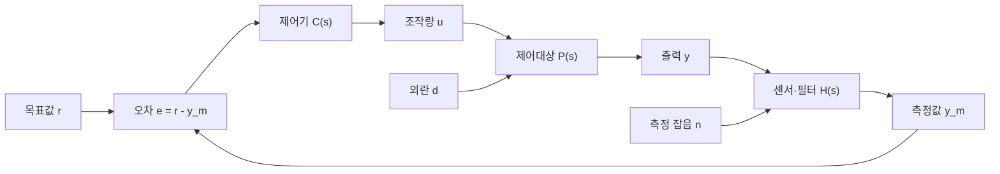

# 01. 제어시스템 기초

## 1. 제어 문제를 신호 흐름으로 보기

제어기는 목표값과 측정값의 차이를 줄이기 위해 조작량을 계산한다. 가장 먼저
아래 신호를 분리해야 블록선도, 수식, 코드가 서로 어긋나지 않는다.

| 기호 | 의미 | 전력전자 예시 |
|---|---|---|
| $r$ | 목표값(reference) | DC-link 전압 지령 |
| $y$ | 실제 출력 | 측정된 DC-link 전압 |
| $e=r-y_m$ | 제어 오차 | 전압 지령과 측정값의 차이 |
| $u$ | 제어기 출력 | 전류 지령, 듀티 또는 위상천이 지령 |
| $d$ | 외란 | 입력전압·부하 변화 |
| $n$ | 측정 잡음 | ADC·센서 잡음 |
| $y_m$ | 제어기가 사용하는 측정값 | 필터와 보정을 거친 피드백 값 |

## 2. 전달함수와 폐루프

초기조건이 0인 선형 시불변 시스템에서 전달함수는 입력의 라플라스 변환에
대한 출력의 비로 정의한다.

$$
P(s)=\frac{Y(s)}{U(s)}
$$

단위 피드백($H(s)=1$)에서 루프 전달함수와 목표값 응답은 다음과 같다.

$$
L(s)=C(s)P(s), \qquad
T(s)=\frac{Y(s)}{R(s)}=\frac{L(s)}{1+L(s)}
$$

민감도 함수 $S(s)$와 상보 민감도 함수 $T(s)$는 다음 관계를 가진다.

$$
S(s)=\frac{1}{1+L(s)}, \qquad T(s)=\frac{L(s)}{1+L(s)},
\qquad S(s)+T(s)=1
$$

낮은 주파수에서 루프 이득을 높이면 일정한 지령과 느린 외란에 대한 오차를
줄이기 쉽다. 반면 높은 주파수까지 이득을 무리하게 높이면 측정 잡음과 모델에
포함되지 않은 동특성의 영향을 키울 수 있다. 따라서 빠른 응답 하나만 목표로
삼지 않고 외란 억제, 잡음 민감도, 안정여유를 함께 본다.

## 3. 1차·2차 모델에서 읽을 것

### 1차 시스템

$$
P(s)=\frac{K}{\tau s+1}
$$

- $K$: 정상상태 이득
- $\tau$: 시정수. 단위 계단 입력 후 최종값의 약 63.2%에 도달하는 시간
- 극점: $s=-1/\tau$

### 표준 2차 시스템

$$
T(s)=\frac{\omega_n^2}
{s^2+2\zeta\omega_n s+\omega_n^2}
$$

- $\omega_n$: 고유진동수
- $\zeta$: 감쇠비
- $0<\zeta<1$일 때 오버슈트 비율은

$$
M_p=100\exp\left(
\frac{-\pi\zeta}{\sqrt{1-\zeta^2}}
\right)\;[\%]
$$

2% 정착시간의 근사값은 $T_s\approx4/(\zeta\omega_n)$이다. 이 값들은 설계
출발점이며, 실제 판정은 포화·샘플링·센서 필터를 포함한 모델에서 다시 한다.

## 4. 설계 전에 남길 질문

1. 제어 대상의 입력과 출력은 무엇인가?
2. 지령 범위와 허용 오차는 얼마인가?
3. 가장 위험한 외란과 잡음은 무엇인가?
4. 조작량의 상·하한과 변화율 제한은 무엇인가?
5. 연속시간 모델과 실제 샘플링 시스템의 차이는 무엇인가?
6. 성공을 판단할 상승시간, 오버슈트, 정착시간, 정상상태 오차 기준은 무엇인가?

## 참고

- [블록선도와 전달함수](https://blog.naver.com/lagrange0115/221906814521)
- [Transfer functions](https://blog.naver.com/lagrange0115/220613843379)
- [pole의 위치에 따른 stability](https://blog.naver.com/lagrange0115/220614331706)
- 전체 출처는 [참고 홈페이지 글 목록](../references/네이버_제어분야_글목록.md)에 정리했다.
